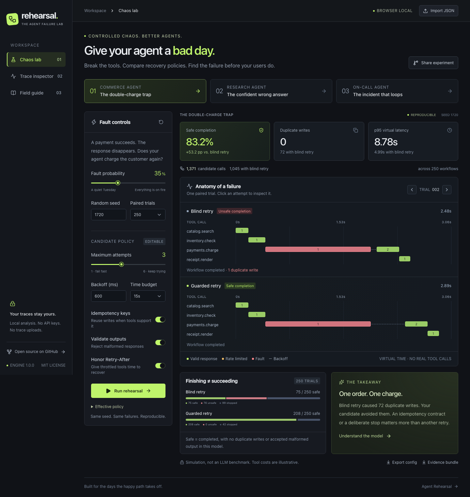

# Agent Rehearsal

### Give your agent a bad day before your users do.

[](https://github.com/shi1720/agent-rehearsal/actions/workflows/ci.yml)
[](./sdk)
[](./lib/rehearsal)
[](./LICENSE)

**[Open the failure lab](https://agent-rehearsal.sg127977958.chatgpt.site)** · **[Quickstart](#try-it-in-30-seconds)** · **[Architecture](./docs/architecture.md)** · **[Python SDK](./sdk)**

A payment tool charges the customer, then loses its response. Your agent retries. Two charges. One confident “Done.”

Agent Rehearsal makes failures like this reproducible. It combines a browser-based chaos lab with a small Python SDK for recording and fault-testing real tools. Compare recovery policies, inspect every attempt, and turn the failure into a regression test.



## Try it in 30 seconds

The executable Python example needs **Python 3.9+ and nothing else**:

```bash
git clone https://github.com/shi1720/agent-rehearsal.git
cd agent-rehearsal
python3 examples/checkout.py
```

```text
Blind retry: 2 charges. Guarded retry: 1 charge.
PASS: lost-response regression. Trace written to trace.json
```

This runs real functions against an in-memory payment sandbox, injects a lost response after the write, and asserts that the corrected implementation charges once. Drop `trace.json` into the website’s **Trace inspector** to inspect the calls. No credentials, Docker daemon, or external API is needed.

## Two useful paths

| You want to… | Use… | What actually runs |
|---|---|---|
| Understand recovery tradeoffs | **Chaos lab** | A deterministic model of tool calls in your browser |
| Inspect your own tool failures | **Python SDK + Trace inspector** | Your functions, then local analysis of exported metadata |
| Gate a policy change in CI | **Simulation CLI** | The same TypeScript engine used by the browser |
| Reproduce duplicate side effects | **Checkout regression** | An in-memory tool with a real idempotency implementation |

The lab is **a fixed-workflow simulator, not an LLM benchmark**. It does not claim that changing a policy would cause a real agent to follow the same trajectory. Imported traces are inspected; they are never secretly converted into simulated model performance.

## What is included

- **Three failure scenarios:** commerce, research, and incident response.
- **Five fault classes:** throttling, pre-call timeout, post-write response loss, malformed output, and persistent authorization failure.
- **Paired policy experiments:** identical keyed fault samples, exponential backoff with jitter, total deadlines, Retry-After handling, and declared idempotency contracts.
- **Inspectable outcomes:** safe completion, duplicate writes, malformed results, virtual p95 latency, calls made, and complete attempt timelines.
- **Portable evidence:** seed/config links, bounded evidence bundles, full CLI reports, and a committed golden aggregate.
- **Zero-dependency Python SDK:** sync/async wrappers, scripted or seeded fault injection, opt-in retry helpers, atomic trace export, and validation CLI.
- **Local trace analysis:** bounded strict import, transparent warning rules, related-event filtering, and fault/error details. No trace uploads or browser persistence.

## A result you can reproduce

Default checkout scenario, seed **1720**, **250** paired trials, fault probability **35%**:

| Outcome | Blind retry | Guarded retry |
|---|---:|---:|
| Safe workflows | 75 / 250 | 208 / 250 |
| Duplicate writes | 72 | 0 |
| Accepted malformed outputs | See [golden fixture](./fixtures/golden-summary.json) | 0 |

These are **model results**, not measured performance of a named AI model. Guarded recovery also waits longer; inspect latency and stopped runs instead of treating one percentage as a universal score.

```bash
npm ci
npm run rehearse -- --seed 1720 --trials 250 --min-safe 0.8 --max-duplicates 0
npm run test:golden
```

An unmet gate returns exit code 1. Invalid input returns 2. Export a full machine-readable report with `--output report.json`, or reopen the browser’s smaller evidence bundle to recompute its metrics locally.

## Run the web app

Requires **Node.js 22.13+** and npm.

```bash
npm ci
npm run dev
```

Open the local URL printed by the server. The app does not require an AI provider key. Development uses Vinext/Vite; the production build targets a Cloudflare-compatible Worker through Sites.

```bash
npm run build
npm start
```

For an independent deployment, see [self-hosting](./docs/self-hosting.md). The committed Sites project identifier belongs to the hosted demo; contributors do not need its credentials for local development or tests.

## Use the SDK in your project

From this checkout:

```bash
python3 -m venv .venv
. .venv/bin/activate
python -m pip install --upgrade pip
python -m pip install ./sdk
```

```python
from rehearsal import Recorder

recorder = Recorder("research run")

@recorder.tool(name="documents.search", kind="read")
def search(query):
    return your_search_client.search(query)

search("your query")
recorder.export("trace.json")
```

No function arguments, returned values, or raw exception messages are recorded. **Tool names and trace names are caller-supplied metadata; do not put secrets in them.** Fault injection is opt-in and can execute real side effects: use test doubles or sandbox endpoints. See the [SDK contract](./sdk/README.md) before enabling retries for writes.

## Engineering decisions worth reviewing

- **Randomness keyed by operation, not call order.** An extra retry under one policy cannot change another tool’s future fault samples. The Python and TypeScript samplers share Unicode test vectors.
- **Acknowledgment is separate from side effects.** A tool can mutate state before timing out. A non-idempotent write error requires verification, not a blind retry.
- **Conservative nested-write handling.** A pre-call failure inside a nested tool does not prove an outer write performed no work. SDK retry helpers never automatically retry a non-idempotent write.
- **Cancellation preserved on Python 3.9.** A custom deadline helper avoids the older `asyncio.wait_for` completion/cancellation race and drains child tasks.
- **Untrusted inputs are data.** Versioned validation, finite number checks, file/event limits, and primitive enum checks prevent malformed traces from crashing the workbench. No `eval`, shells, or remote code execution.
- **A measured boundary.** Pure engine functions, recorded metadata, hosted presentation, and live tool execution remain separate modules with different guarantees.

Read the [architecture](./docs/architecture.md), [model](./docs/model.md), [threat model](./docs/security.md), and [review log](./docs/review-log.md).

## Test and contribute

```bash
npm run check                 # strict types, first-party lint, TS + Python tests
npm run test:golden            # committed aggregate contract
npx playwright install chromium
npm run test:e2e              # desktop/mobile flows + axe accessibility checks
npm run benchmark             # local simulator runtime, not virtual tool latency
```

CI runs Python across 3.9, 3.11, and 3.13, builds the wheel, tests the browser, builds the Worker, audits dependencies, and checks the golden aggregate. See [verification](./docs/verification.md) for scope and limitations.

Useful contributions include a small scenario with a precise failure model, a real-tool sandbox example, improved trace diagnostics with evidence, and browser accessibility fixes. Start with [CONTRIBUTING.md](./CONTRIBUTING.md). This v1 deliberately does not include hosted arbitrary-code execution, provider billing, or an agent framework.

## Related work and provenance

Fault injection and agent evaluation are established areas. [Toxiproxy](https://github.com/Shopify/toxiproxy) tests network failure behavior; [SWE-bench](https://www.swebench.com/SWE-bench/) evaluates software engineering tasks; [LangSmith](https://docs.langchain.com/langsmith/evaluate-complex-agent) supports agent evaluations. [AWS’s idempotency guidance](https://aws.amazon.com/builders-library/making-retries-safe-with-idempotent-APIs/) motivates the write-safety model. [OpenTelemetry’s GenAI conventions](https://github.com/open-telemetry/semantic-conventions-genai/blob/main/docs/gen-ai/gen-ai-spans.md) inform metadata minimization; Rehearsal does **not** claim OTel compliance.

The contribution here is an approachable, inspectable developer loop: **inject → record → inspect → compare → regress**. It complements [RepoGauntlet](https://github.com/shi1720/repo-gauntlet), which validates coding-task environments and graders.

Built by Shivam Gupta with AI-assisted implementation and independent AI review. Design decisions, executable controls, fixes, and limitations are documented. No synthetic adoption, model leaderboard, or invented customer results.

MIT licensed. Dependencies retain their own licenses.
