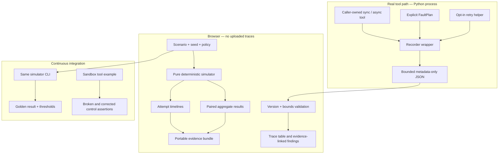

# Architecture

Agent Rehearsal separates the observations of real tool calls from a model of possible recovery policies. This boundary is the central design decision.



## Modules and ownership

| Module | Responsibility | Excluded responsibility |
|---|---|---|
| `sdk/src/rehearsal/recorder.py` | Wrap calls, bound recording, classify local provenance, export | Retry decisions, secrets in caller-supplied labels |
| `sdk/src/rehearsal/chaos.py` | Explicit scripted/seeded faults, shared hash sampler | Network interception, global monkey-patching |
| `sdk/src/rehearsal/retry.py` | Conservative retry classification and deadlines | Supplying or verifying an idempotency contract |
| `sdk/src/rehearsal/schema.py` | Portable trace validation | Inferring task success |
| `lib/rehearsal/engine.ts` | Pure fixed-workflow simulations and aggregates | LLM execution, real tools, imported-trace extrapolation |
| `lib/rehearsal/validation.ts` | Browser/CLI input boundary | Trusting imported report metrics |
| `lib/rehearsal/report.ts` | Small evidence bundles with explicit example selection | Hiding how a displayed trial was selected |
| `app` and presentation components | Controls, timelines, metadata inspection | Secret storage, backend agent execution |
| `scripts` | Headless simulations, golden gate, local benchmark | A hosted multi-tenant job system |

## Simulation algorithm

Each logical workflow contains a bounded sequence of tool steps. A step has a read/write kind, latency, illustrative cost, fault class, and an explicit idempotency capability. Each policy has attempt, backoff, timeout, total-deadline, validation, and retry-classification settings.

1. Sample the step/attempt fault using a keyed deterministic hash.
2. Apply persistent authorization state or an active rate-limit cooldown.
3. Check that the full modeled call duration fits the remaining time budget. If not, start no call and charge no cost.
4. Advance virtual time and account for the attempt.
5. Track side effects separately from acknowledgments. Repeated supported keyed writes reuse the operation; unsupported ones may duplicate it.
6. Accept valid responses, explicitly reject or accept malformed responses according to policy, and classify failures.
7. Stop for an unsafe ambiguous write, a permanent error, or an exhausted attempt/deadline budget. Otherwise compute jittered backoff, respect Retry-After when enabled, and continue.
8. Aggregate safe completion, completion, duplicates, malformed acceptances, calls, costs, mean time, and nearest-rank p95.

With `N` trials, `S` steps and `A` maximum attempts, runtime and stored event space are **O(N × S × A)**. The public comparison boundary allows at most 1,000 paired trials and six attempts per step. UI rendering shows one paired trial and paginates real traces in groups of 50.

## Reproducibility

The random key is UTF-8 text:

```text
seed:trial:step-id:attempt:channel
```

FNV-1a followed by two uint32 avalanche multiplications yields a sample in `[0,1)`. Jitter uses a separate channel. Integer arithmetic is explicitly masked in Python and uses `Math.imul`/unsigned shifts in TypeScript. Shared golden vectors include Unicode identifiers.

This is a **test sampler**, not cryptography. Equal inputs on the same engine version reproduce complete reports. Tool identity and trial/attempt IDs determine paired faults; executing extra retries under a policy does not shift other operations' samples.

SDK traces contain actual measured duration and are not byte-identical between real runs. The sandbox example proves semantic behavior with assertions. The browser golden report uses virtual time and is fully deterministic.

## Trust boundaries

- A real Python tool runs with the caller process's privileges. There is no sandbox supplied by the SDK.
- The browser receives only bounded JSON. It never evaluates code or shells out.
- The hosted Worker serves the app; imports and simulations execute locally in the browser.
- Trace metadata stays in memory until the tab is cleared or closed. Files selected by the user still exist on their own device.
- Sharing serializes experiment configuration. It never includes imported trace data. Reopening an evidence bundle recomputes results instead of trusting embedded claims.

## Deployment

The web application is React 19 and strict TypeScript, built through Vinext/Vite to a Worker-compatible artifact. UI controls reuse accessible Base UI/Shadcn primitives; the visual system and functional timeline are custom CSS/React. There is no application database because the v1 product does not need accounts, server persistence, or a job queue.

See [self-hosting](./self-hosting.md), [security](./security.md), and [model semantics](./model.md).
